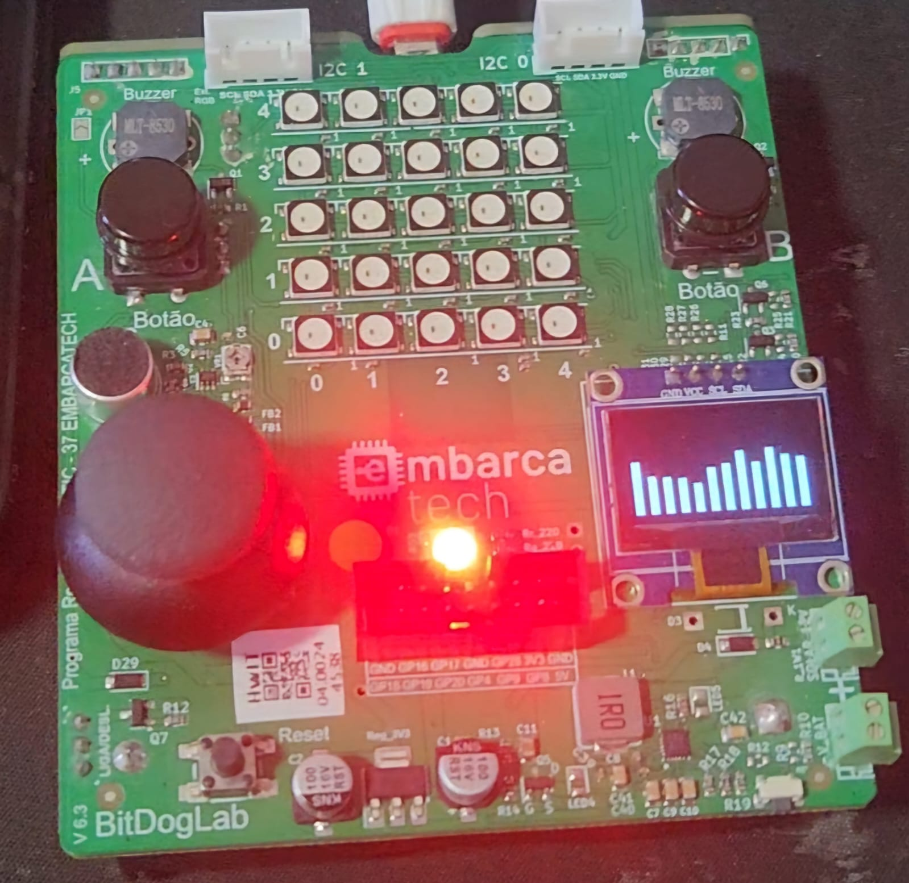
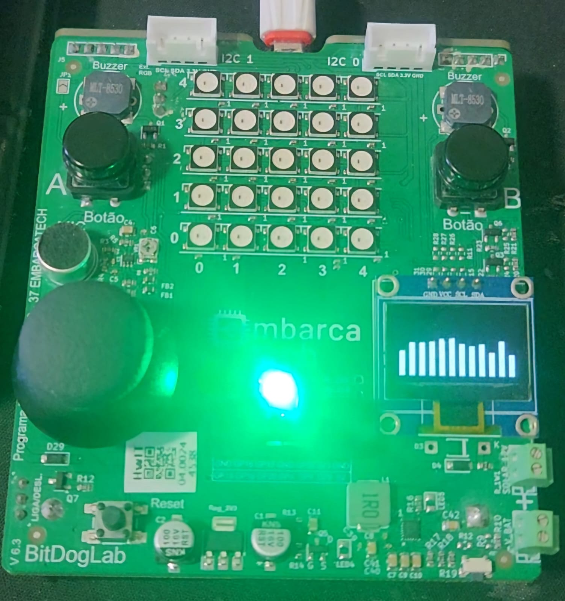

# Projetos de Sistemas Embarcados - EmbarcaTech 2025

Autor: **Gabriel Martins Ribeiro**

Curso: Residência Tecnológica em Sistemas Embarcados

Instituição: EmbarcaTech - HBr

Brasília, Junho de 2025

---

# 🎶 Audio Synth

BitDogLab Audio-Synth grava **10 s** de áudio a **16 kHz**, armazena em RAM e
reproduz em um buzzer via PWM. Durante ambos os modos, exibe um **VU-meter  
12 × 64 px** em tempo real no display OLED SSD1306 (128 × 64).

---

## 📷 Demonstração

| Gravação (LED vermelho)         | Reprodução (LED verde)        |
| :-----------------------------: | :---------------------------: |
|             |         |


---

## ▶ Vídeo de Demonstração

Assista ao protótipo funcionando no YouTube:

[](https://youtube.com/shorts/sCS0l5j58IU?feature=share)

Clique na imagem acima para acesso ao link, ou  se preferir um link simples:

[▶ Demo no YouTube](https://youtube.com/shorts/sCS0l5j58IU?feature=share)

---


## 🗂 Estrutura do Código

| Arquivo                       | Descrição                                  |
| ----------------------------- | ------------------------------------------ |
| **main.c**                    | FSM, splash-screen, timers ADC/PWM e VU-meter |
| **ssd1306.c / ssd1306.h**     | Driver do display OLED SSD1306             |
| **font.c / font.h**           | Fonte 5 × 8 pixels usada nas strings       |
| **CMakeLists.txt**            | Script de build para Pico SDK              |
| **pico_sdk_import.cmake**     | Importação do Pico SDK                     |

---

## ✅ Funcionalidades

- Splash “AUDIO SYNTH!” aguarda botão A  
- Grava 10 s a 16 kHz (12→8 bits)  
- Reproduz via PWM a 16 kHz (8 bits)  
- VU-meter 12 barras em gravação e reprodução  
- LED vermelho ◉ gravação / LED verde ◉ reprodução  
- Botões A (GP 5) e B (GP 6)  
- Buffer duplo e flush sem flicker no OLED

---

## 🔧 Hardware

| Componente                     | Conexão                         |
| -----------------------------  | ------------------------------  |
| Pico W (RP2040)                | —                                |
| Microfone de eletreto          | ADC2 → GPIO 28                   |
| Buzzer passivo                 | PWM → GPIO 10                    |
| Botão A / Botão B              | GPIO 5 / GPIO 6                  |
| OLED SSD1306 128 × 64          | I²C1: SDA → GPIO 14  SCL → GPIO 15 |
| LED vermelho / LED verde       | GPIO 13 / GPIO 11                |

---
## 🔄 Fluxograma do Sistema

```mermaid
flowchart TD
  %% ───────── INICIALIZAÇÃO ─────────
  A["🚀 INÍCIO<br/>main()"] --> B["📡 Inicializar Sistema<br/>stdio_init_all()"]
  B --> C["⏳ Aguardar USB<br/>stdio_usb_connected()"]
  C --> D["🖥️ Init OLED<br/>i2c_init() + ssd1306_init()"]

  %% ───────── HARDWARE SETUP ─────────
  D --> E["⚙️ Configurar Hardware"]
  E --> E1["🔴 Botão A<br/>GP5 + pull-up + IRQ"]
  E --> E2["🟢 Botão B<br/>GP6 + pull-up + IRQ"]
  E --> E3["🔴 LED REC<br/>GP13"]
  E --> E4["🟢 LED PLAY<br/>GP11"]
  E --> E5["🎤 Microfone<br/>ADC2 @ GP28"]
  E --> E6["🔊 Buzzer<br/>PWM @ GP10"]

  %% ───────── LOOP PRINCIPAL ─────────
  E1 & E2 & E3 & E4 & E5 & E6 --> F["🔄 Loop<br/>while(true)"]
  F --> G["🖼️ flush_if_ready()"]
  G --> H{"🎯 switch(state)"}

  %% ───────── TRÊS ESTADOS ─────────
  H -->|IDLE| I["😴 Idle<br/>tight_loop_contents()"]
  H -->|REC|  J["🎙️ Gravação"]
  H -->|PLAY| K["🔊 Reprodução"]

  %% ───────── GRAVAÇÃO ─────────
  subgraph GRAVAÇÃO
    J --> JR1["LED Vermelho ON"]
    JR1 --> JR2["adc_init()"]
    JR2 --> JR3["Start ADC Timer<br/>16 kHz"]
    JR3 --> JR4["adc_cb()"]
    JR4 --> JR5{"wr_i ≥ NUM_SAMPLES?"}
    JR5 -->|Não| JR4
    JR5 -->|Sim| JR6["LED Vermelho OFF<br/>rec_done = true"]
    JR6 --> I
  end

  %% ───────── REPRODUÇÃO ─────────
  subgraph REPRODUÇÃO
    K --> KP1["LED Verde ON"]
    KP1 --> KP2["gpio_set_function()<br/>PWM"]
    KP2 --> KP3["Configurar PWM<br/>wrap = 255, clkdiv = 1"]
    KP3 --> KP4["Start PWM Timer<br/>16 kHz"]
    KP4 --> KP5["pwm_cb()"]
    KP5 --> KP6{"rd_i ≥ NUM_SAMPLES?"}
    KP6 -->|Não| KP5
    KP6 -->|Sim| KP7["LED Verde OFF<br/>play_done = true"]
    KP7 --> I
  end

  %% ───────── INTERRUPÇÕES ─────────
  BTN_A_IRQ[/"IRQ Botão A<br/>btn_isr()"/] -.->|state = REC| J
  BTN_B_IRQ[/"IRQ Botão B<br/>btn_isr()"/] -.->|state = PLAY| K

```


---

## ⚙️ Como Compilar

```bash
cd projects/Audio_Synth
mkdir build && cd build
cmake ..
make -j4
# Produz: AudioSynth.uf2
```
---

## 🚀 Uso

1. Ligue o Pico com o firmware.  
2. No splash **“AUDIO SYNTH!”**, pressione **A** para gravar (LED vermelho).  
3. Após 10 s, o LED apaga. Pressione **B** para reproduzir (LED verde).  
4. Observe o VU-meter no OLED e escute o buzzer.  

---

## 💭 Reflexão Final

- **Técnicas de programação que podem ser utilizadas para melhorar a gravação e a reprodução do áudio:**  
  - **DMA + ADC FIFO:** captura as amostras de forma contínua, sem overhead de CPU.  
  - **PIO + PWM DMA:** gera o sinal de saída exatamente a 16 kHz sem jitter.  
  - **Buffers circulares (ring buffer):** garante fluxo ininterrupto de dados, evitando under-/overflows.  
  - **Interrupções e timers hardware:** mantém o timing estritamente preciso para amostragem e reprodução.  
  - **Filtragem no firmware (média móvel ou passa-baixa):** reduz ruídos de alta frequência antes de armazenar ou tocar.

- **Formas de gravar áudios mais extensos, sem prejudicar a qualidade da gravação:**  
  - **Stream para memória externa (flash ou cartão SD):** libera a RAM do Pico e permite dezenas de megabytes de armazenamento.  
  - **Compressão em tempo real (ADPCM, µ-law):** reduz o tamanho das amostras de 12 ou 16 bits para 4–8 bits sem perda perceptível.  
  - **Gravação em blocos (chunking) com flush imediato:** divide o áudio em páginas e grava cada bloco no meio externo para evitar consumo excessivo de RAM.  
  - **Driver de sistema de arquivos (FAT) + DMA:** escreve diretamente no cartão SD via DMA, mantendo performance e qualidade de amostragem.

---

## 📜 Licença
GNU GPL-3.0.

